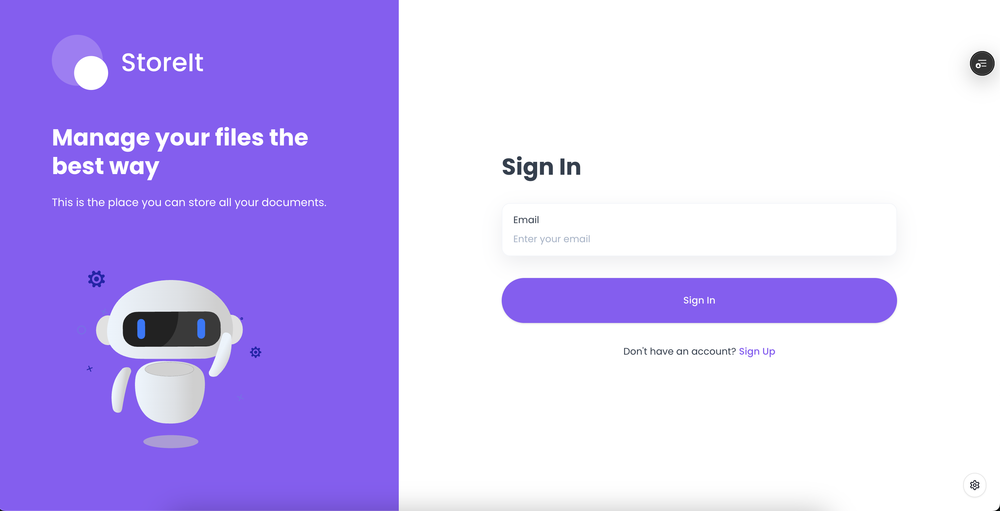
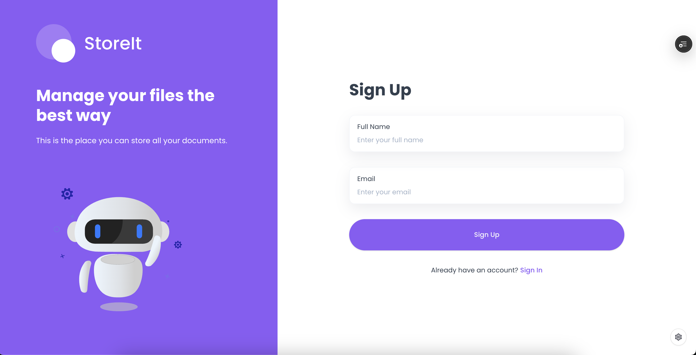
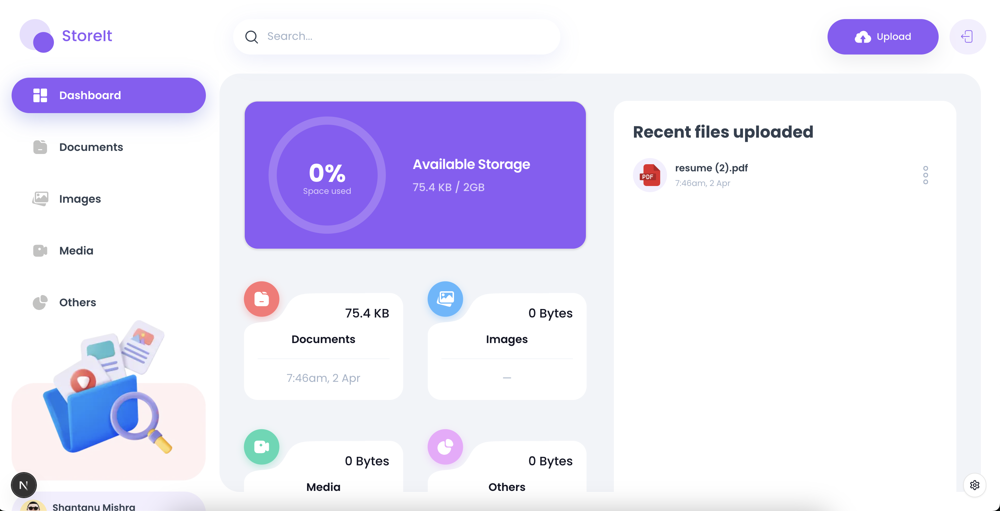
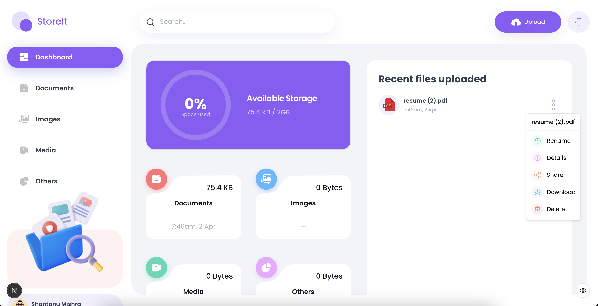

---
<div align="center">
<h1>Upload It</h1>
<br />
<div>


</div>
<h3 align="center">Storage and File Sharing Platform</h3>
</div>
---

## 📋 Table of Contents

1. [Introduction](#introduction)
2. [Live Demo](#live-demo)
3. [Tech Stack](#tech-stack)
4. [Features](#features)
5. [Screenshots](#screenshots)
6. [Performance](#performance)
7. [Local Setup](#local-setup)
8. [Testing](#testing)
9. [Developer](#developer)

---

## 🤖 Introduction

**Upload It** is a modern storage management and file sharing platform that allows users to upload, manage, and share files easily. Built using the latest technologies like React 19, Next.js 15, Appwrite, TailwindCSS, and ShadCN UI, it offers a powerful yet elegant user experience.

---

## 🌐 Live Demo

- **Live URL**: [https://upload-it-beta.vercel.app](https://upload-it-beta.vercel.app/)
- **GitHub Repo**: [https://github.com/me-shantanu/upload-it](https://github.com/me-shantanu/upload-it)

---

## ⚙️ Tech Stack

- React 19
- Next.js 15
- Appwrite
- TailwindCSS
- ShadCN UI
- TypeScript
- Jest + React Testing Library

---

## 🔋 Features

- User Authentication with Appwrite
- File Upload (documents, images, videos, audio)
- View, Rename, and Delete Files
- File Download & Preview in New Tab
- Share Files via Unique Link
- Dashboard with Storage Stats
- Global File Search
- Sorting by Name, Size, or Date
- Fully Responsive UI

---

## 🖼️ Screenshots

> - Login / Signup screen  
>    > 
> - File Upload screen
>   
> - Dashboard with file stats
>   
> - Responsive Design
>   

---

## 📈 Performance

**Lighthouse Audit Scores:**

| Platform | Performance | Accessibility | Best Practices | SEO |
| -------- | ----------- | ------------- | -------------- | --- |
| Mobile   | 99          | 91            | 96             | 92  |
| Desktop  | 99          | 100           | 96             | 91  |

**Highlights**:

- Lazy Loading & Code Splitting
- Compressed Images
- Optimized Next.js Configuration
- Semantic HTML & Accessibility Tags

> A full Lighthouse report PDF is available in the `docs/` folder or can be reproduced using Chrome DevTools.

---

## 🤸 Local Setup

### Prerequisites

- [Node.js](https://nodejs.org/)
- [npm](https://www.npmjs.com/)
- [Git](https://git-scm.com/)

### Getting Started

```bash
git clone https://github.com/meshantanu/upload-it.git
cd upload-it
npm install
npm run dev
```

Visit [http://localhost:3000](http://localhost:3000) in your browser.

> Appwrite configuration instructions are provided in `.env.example`.

---

## 🧪 Testing

Unit tests are written using **Jest** and **React Testing Library**.

### Run Tests

```bash
npm run test
```

### Test Coverage

- Core UI components (UploadForm, FileCard, FileList)
- Search and filter logic
- Auth flow handling

> Test coverage summary will appear in the terminal and can be exported using `--coverage`.

---

## 👨‍💻 Developer

**Shantanu Mishra**

- **Email**: shantmiitanphy@gmail.com
- **LinkedIn**: [https://www.linkedin.com/in/meshantanumishra/](https://www.linkedin.com/in/meshantanumishra/)

---
